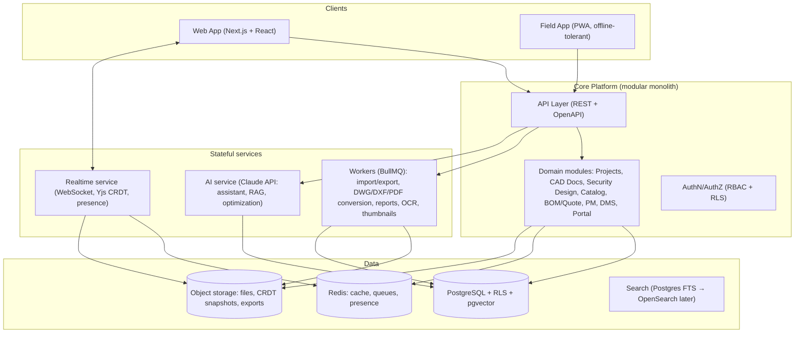

# 00 — Executive Summary

> **Platform codename:** *Perimeter* (working name — a unified design–build–operate platform for technology and physical-security projects).
> **Status:** Architecture phase. No code exists yet. This document set is the contract for what gets built and in what order.

---

## 1. What we are building

A cloud-first, AI-first, collaboration-first SaaS platform where companies that design and deliver technology projects — physical security, ELV/low-voltage, AV, networking, smart building — run the **entire project lifecycle in one place**:

```
Survey → Design (CAD + camera engineering) → BOM → Quote → Procure → Plan → Build → Commission → Hand over → Operate
```

Today that lifecycle is spread across AutoCAD, JVSG/System Surveyor, Excel, Microsoft Project, WhatsApp, email, a procurement system, and a file server. Every hand-off between those tools loses information, and the "single source of truth" is whoever last exported a PDF. The product thesis: **the drawing is the database**. When a camera on the floorplan *is* a catalog product, a BOM line, a task, a cable run, and a commissioning checklist item, the hand-off losses disappear.

## 2. Challenge to the original concept (read this first)

The brief asks for "a browser-based CAD editor similar to AutoCAD" as Module 1. As CTO, I am pushing back on the *sequencing*, not the vision:

### 2.1 Don't fight Autodesk on general CAD — win the vertical first

- General-purpose browser CAD is a decade-long, capital-intensive fight against Autodesk (Fusion/AutoCAD Web), Onshape, and Graebert (who license their engine to everyone else). It is a commodity war we cannot win as an entry move.
- **The winnable wedge is vertical: security & ELV system design.** Competitors are fragmented and weak precisely where we are strong:
  - **JVSG (IP Video System Design Tool)** — great camera math, desktop-only, no collaboration, no BOM-to-procurement, dated UX.
  - **System Surveyor** — good site survey and device placement, weak CAD, no camera optics engineering, no procurement.
  - **D-Tools / Jetbuilds** — strong catalog/proposal, no real design canvas.
  - **roundefence-style simulators** — impressive FoV simulation, single-purpose, no project lifecycle.
  - **Procore / Monday** — project management with zero design intelligence.
- Nobody owns *design → engineering-grade camera math → live BOM → quote → procurement → field* in one collaborative browser app. That is the beachhead. General CAD capability grows outward from the vertical (the canvas we must build for camera design *is* a 2D CAD editor — we simply don't market it as an AutoCAD replacement until it's earned).

### 2.2 DWG is a licensing trap — treat it as an import problem, not a native format

Native DWG read/write realistically requires the Open Design Alliance SDK (expensive annual licensing, C++ toolchain) or Autodesk's own Forge/APS cloud APIs (per-call cost, sends customer files to Autodesk). Decision:

- **Native document format is our own scene graph** (JSON semantics inside a CRDT — see [doc 06](06-cad-engine.md) and [doc 10](10-collaboration-realtime.md)).
- **Phase 1 interop:** PDF / PNG / JPEG / SVG underlays (in practice, consultants receive floorplans as PDFs ~80% of the time) + **DXF import** (open spec, parseable in TS).
- **Phase 2 interop:** DWG import/export via a sandboxed conversion worker (ODA Drawings SDK or APS Design Automation), IFC import for BIM context.
- This converts a company-killing upfront cost into a scheduled, priceable milestone.

### 2.3 Modular monolith now, microservices when the seams hurt

The brief asks for microservices. With a team of 1–10 engineers, microservices multiply every cost (deploys, observability, contracts, local dev) before there is any scale to justify them. Decision: **one deployable modular monolith** with strictly enforced internal module boundaries, plus **separate worker services only where the workload profile demands it from day one** (CPU-bound file conversion, rendering, report generation, and the stateful realtime/CRDT server). Extraction paths are pre-drawn in [doc 02](02-system-architecture.md).

### 2.4 Features the brief is missing (added to scope)

| Gap | Why it matters |
|---|---|
| **Quoting / proposals** | The brief jumps from BOM to procurement. The document that actually wins revenue is the client-facing quote/proposal (versioned, margin-controlled, e-signable). This is the #1 monetizable artifact. |
| **Mobile site-survey / field mode** | Surveys and installs happen on-site on tablets/phones. Photo pins on the floorplan, device status, offline tolerance. System Surveyor's entire business is this gap. |
| **Cable & pathway engineering** | Cameras are useless without cable runs. Auto-routed containment, distance-driven cable BOM, PoE budget validation, switch port allocation. Huge differentiator, mostly geometry we already need. |
| **Standards engine** | IEC 62676-4 DORI, GDPR privacy zones, region-specific rules. Turns camera math into *defensible engineering*, which is what security consultants sell. |
| **Commissioning & as-built** | Per-device checklists, photo evidence, snag lists, as-built drawing generation. Closes the loop and locks in the operate phase. |
| **Enterprise identity** | SSO (SAML/OIDC), SCIM provisioning, audit exports. Table stakes for the enterprise tier. |
| **i18n + RTL** | Hebrew/Arabic RTL support designed-in from the UI foundation, not retrofitted. |

## 3. Architecture in one page



Full detail with C4 diagrams, tenancy model, and every technology decision: [doc 02 — System Architecture](02-system-architecture.md).

## 4. Key decisions register

| # | Decision | Choice | Rationale / doc |
|---|---|---|---|
| D1 | Market entry | Security/ELV design wedge, general CAD later | §2.1, [doc 01](01-product-strategy.md) |
| D2 | Native drawing format | Own scene graph in Yjs CRDT | [doc 06](06-cad-engine.md), [doc 10](10-collaboration-realtime.md) |
| D3 | DWG strategy | Import via conversion worker (phase 2); DXF + PDF underlay first | [doc 06](06-cad-engine.md) |
| D4 | Service topology | Modular monolith + realtime service + workers | [doc 02](02-system-architecture.md) |
| D5 | Multi-tenancy | Single Postgres cluster, `org_id` on every row, RLS enforced | [doc 02](02-system-architecture.md), [doc 04](04-permissions-model.md) |
| D6 | Realtime collaboration | Yjs CRDT over WebSocket, snapshot compaction to object storage | [doc 10](10-collaboration-realtime.md) |
| D7 | Canvas rendering | WebGL2 (custom renderer on a thin library), Canvas2D fallback | [doc 06](06-cad-engine.md) |
| D8 | Permissions | Role templates + granular permission grants + resource ACLs, mirrored in Postgres RLS | [doc 04](04-permissions-model.md) |
| D9 | API style | REST + OpenAPI for CRUD, WebSocket for realtime, webhooks for integrations | [doc 05](05-api-architecture.md) |
| D10 | AI | Claude via tool-use over internal APIs; RAG with pgvector; deterministic math stays in the geometry engine, never the LLM | [doc 12](12-ai-architecture.md) |
| D11 | Hosting posture | Cloud-native containers; Supabase-compatible but self-hostable schema (enterprise/white-label) | [doc 02](02-system-architecture.md) |
| D12 | Monorepo | pnpm + Turborepo; `apps/*` + `packages/*` | [doc 02](02-system-architecture.md) |

## 5. Roadmap in one paragraph

**M0** platform foundation (orgs, auth, RBAC, app shell) → **M1** CAD core (canvas, layers, snapping, PDF/DXF underlay) → **M2** security design engine (FoV, DORI, coverage — the differentiator) → **M3** catalog + BOM + quoting (the money loop) → **M4** realtime collaboration → **M5** project management → **M6** client & supplier portals → **M7** DMS + AI assistant → **M8** dashboards, marketplace commerce, enterprise. Details, exit criteria, and rationale: [doc 14](14-roadmap-and-risks.md).

## 6. Document map

| Doc | Contents |
|---|---|
| [01 — Product Strategy](01-product-strategy.md) | Personas, competition, missing features, business model |
| [02 — System Architecture](02-system-architecture.md) | C4 diagrams, tenancy, tech stack, deployment, scaling |
| [03 — Database Schema](03-database-schema.md) | ERDs + DDL for every domain |
| [04 — Permissions Model](04-permissions-model.md) | 14 roles × modules matrix, ACLs, RLS |
| [05 — API Architecture](05-api-architecture.md) | Conventions, auth, endpoint catalog, webhooks, realtime protocol |
| [06 — CAD Engine](06-cad-engine.md) | Renderer, scene graph, geometry kernel, import/export |
| [07 — Security Design Module](07-security-design-module.md) | FoV math, DORI, coverage, heatmaps, optimization |
| [08 — Catalog & BOM](08-catalog-and-bom.md) | Product model, design↔product binding, BOM/quote engine |
| [09 — Project Management](09-project-management.md) | Tasks, Gantt/CPM, approvals, change control |
| [10 — Collaboration & Realtime](10-collaboration-realtime.md) | Yjs architecture, presence, comments, versions |
| [11 — Documents & Portals](11-documents-and-portals.md) | DMS, OCR, client portal, supplier workflows, RFIs |
| [12 — AI Architecture](12-ai-architecture.md) | Assistant, RAG, optimization, guardrails |
| [13 — UI Architecture](13-ui-architecture.md) | Design system, app shell, key screens, theming |
| [14 — Roadmap & Risks](14-roadmap-and-risks.md) | Milestones M0–M8, risk register, scalability plan |

---

*Repo note: this design currently lives on a branch of the `EHArviv/EHArviv` profile repository. Before implementation begins, create a dedicated repository (e.g. `eharviv/perimeter`) and move `docs/` there as its first commit.*
