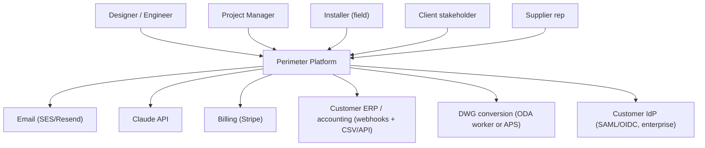
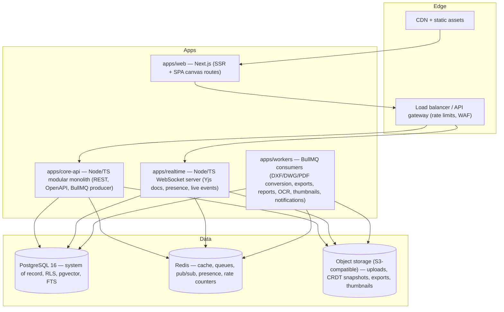
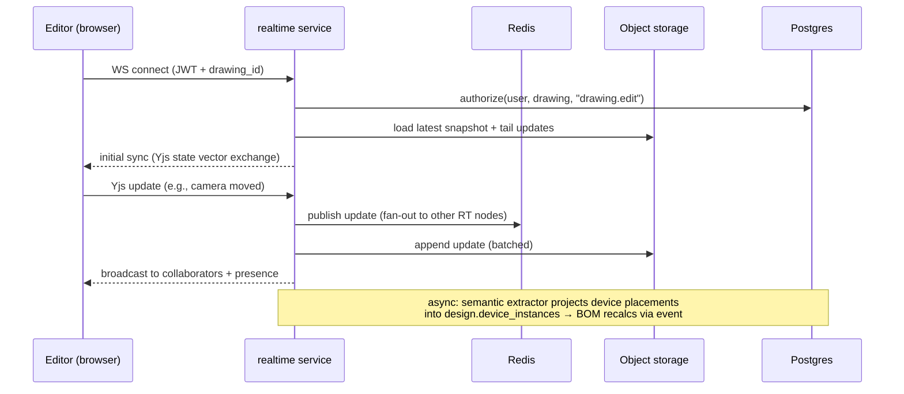

# 02 — System Architecture

## 1. Architectural principles

1. **The drawing is the database.** Design objects, catalog products, BOM lines, tasks, and field records reference each other by ID — never by copy-paste.
2. **Modular monolith, pre-cut seams.** One deployable core with enforced module boundaries (import-linted packages, module-private tables). Services are extracted only when a workload profile (CPU, statefulness, scaling curve) demands it — two qualify on day one: the realtime CRDT server and the conversion/report workers.
3. **Deterministic math is code, not AI.** Optics, geometry, costing, and CPM scheduling live in typed, unit-tested engines. AI orchestrates and explains; it never computes the number on the report.
4. **Multi-tenant by construction.** `org_id` on every tenant-scoped row, enforced by Postgres RLS *and* application guards (belt and suspenders).
5. **API-first.** The web app consumes the same versioned REST API that customers and integrations get.
6. **Self-hostable posture.** Managed services (Supabase, cloud queues) are adapters, not load-bearing walls — enterprise/white-label requires running the stack in a customer VPC.

## 2. C4 — Level 1: System context



## 3. C4 — Level 2: Containers



### Container responsibilities

| Container | Runtime | Scaling | Notes |
|---|---|---|---|
| `apps/web` | Next.js on Node | Horizontal, stateless | Marketing + dashboard pages SSR; editor routes are client-heavy SPA islands |
| `apps/core-api` | Node 22 / TypeScript (Fastify) | Horizontal, stateless | All domain modules; OpenAPI generated from route schemas (zod) |
| `apps/realtime` | Node / TS + `ws` + Yjs | Horizontal with **doc-sticky routing** (consistent hashing on `drawing_id` via Redis registry) | Holds hot CRDT docs in memory; persists updates; broadcasts presence |
| `apps/workers` | Node / TS + BullMQ; conversion images may embed native tools | Horizontal per-queue | Each queue independently scalable; DWG worker is an isolated container (licensing + native deps) |

## 4. Domain modules inside `core-api`

```
core-api/src/modules/
  identity/        orgs, users, memberships, invitations, SSO
  authz/           roles, permissions, ACLs, RLS session context
  projects/        projects, sites, buildings, floors, project membership
  drawings/        drawing docs, sheets, versions, snapshots metadata
  design/          device instances, zones, cable runs (semantic layer over drawings)
  security-calc/   optics/DORI/coverage computations (pure package, no I/O)
  catalog/         products, suppliers, price lists, revisions
  bom/             BOM lines, cost rollups, quotes, purchase packages
  pm/              tasks, milestones, dependencies, risks, issues, change requests
  collab/          comments, mentions, notifications, activity log
  dms/             documents, folders, versions, signatures, OCR index
  portal/          client/supplier scoped views, approvals, RFIs, submittals
  ai/              assistant orchestration, RAG indexing, tool registry
  billing/         plans, seats, usage metering, Stripe sync
  audit/           append-only audit events, export
```

**Boundary rules (lint-enforced):** modules expose a typed public interface (`index.ts`); cross-module calls go through those interfaces or domain events; no module touches another module's tables directly.

**Domain events:** an in-process event bus (backed by a Postgres `outbox` table drained to Redis pub/sub) carries events like `device.placed`, `bom.line_changed`, `quote.approved`. Workers, notifications, webhooks, and the activity log consume the same stream. This is the future seam for extraction to a real broker (NATS/Kafka) — nothing else changes.

## 5. Multi-tenancy

- **Single Postgres cluster, shared schema.** Every tenant-scoped table carries `org_id uuid not null`.
- **RLS enforced** with `set_config('app.org_id', …)` per request/transaction; policies in [doc 04 §6](04-permissions-model.md).
- **Cross-tenant by design, not accident:** supplier↔integrator collaboration and the marketplace are explicit *link tables* (`org_relationships`, `project_external_members`) with their own RLS policies — never a bypass of tenancy.
- **Escape hatches for scale/enterprise:** the schema avoids cross-tenant FK joins in hot paths, so a large tenant can later be migrated to a dedicated database (same schema) behind a tenant-router. White-label/self-host = same containers, customer's Postgres.
- **Object storage:** keys prefixed `org/{org_id}/…`; presigned URLs only, scoped per object, short TTL.

## 6. Technology decisions (with rationale)

| Area | Choice | Rationale / rejected alternatives |
|---|---|---|
| Language | **TypeScript end-to-end** | One language across web, API, realtime, workers, and the geometry engine (shared types from schema to canvas). Rust/WASM reserved for proven geometry hotspots. |
| Web | **Next.js + React 19** | Brief preference; SSR for portal/dashboard SEO-free speed, SPA islands for the editor. |
| API framework | **Fastify + zod + generated OpenAPI** | Faster than Express, schema-first validation, free API docs/clients. NestJS rejected: ceremony without benefit at this scale. |
| Styling | **Tailwind + Radix primitives** | Brief preference; Radix gives accessible primitives for the design system ([doc 13](13-ui-architecture.md)). |
| DB | **PostgreSQL 16** | RLS (tenancy), pgvector (RAG), FTS (search v1), LISTEN/NOTIFY, jsonb (product specs). One database technology until proven otherwise. |
| Supabase | **Compatible, not required** | Great for speed (auth, storage, Postgres) but auth and storage are wrapped behind our own interfaces so enterprise self-host doesn't fork the codebase. |
| Cache/queue | **Redis + BullMQ** | Queues, presence, pub/sub, rate limiting in one operationally boring component. Kafka rejected until event volume demands it. |
| Realtime | **Yjs CRDT over WebSocket** | See [doc 10](10-collaboration-realtime.md). OT rejected (server-serialized, worse offline story); Liveblocks/PartyKit rejected as core dependency (self-host requirement) though patterns are borrowed. |
| Canvas | **WebGL2 renderer (thin custom engine), Canvas2D fallback** | See [doc 06](06-cad-engine.md). |
| Search | **Postgres FTS → OpenSearch when needed** | Don't run a search cluster before search volume exists. |
| Files | **S3-compatible object storage** | Ubiquitous, self-hostable (MinIO). |
| Auth | **OIDC-based (own service wrapping a library, or Supabase Auth adapter)** + SAML/SCIM at enterprise tier | Sessions = short-lived JWT + rotating refresh; API keys for machine access ([doc 05](05-api-architecture.md)). |
| AI | **Claude API (claude-sonnet-5 default, claude-haiku-4-5 for cheap paths)** | Tool-use over internal APIs; see [doc 12](12-ai-architecture.md). |
| Deploy | **Docker containers; start on a PaaS (Fly/Render/Railway) or single k8s cluster; IaC from day one (Terraform)** | Kubernetes-ready but not Kubernetes-first. |
| Monorepo | **pnpm workspaces + Turborepo** | Shared packages with strict boundaries. |
| Observability | **OpenTelemetry → Grafana stack (or vendor); Sentry for errors** | Traces across API→queue→worker are essential with async pipelines. |

## 7. Monorepo layout

```
perimeter/
  apps/
    web/            Next.js app (dashboard, portals, editor shell)
    core-api/       Fastify modular monolith
    realtime/       WebSocket + Yjs server
    workers/        BullMQ consumers (one image, queue-selected; DWG worker separate image)
  packages/
    ui/             design system (Radix + Tailwind components, tokens, themes)
    cad-engine/     renderer, scene graph, tools, snapping (framework-agnostic TS)
    geometry/       pure 2D kernel: vectors, curves, intersections, visibility polygons, spatial index
    security-calc/  optics, DORI, coverage math (pure, unit-tested against JVSG-verified fixtures)
    schemas/        zod schemas + generated OpenAPI types shared FE/BE
    db/             drizzle schema, migrations, RLS policies, seeds
    eslint-config/, tsconfig/
```

## 8. Request & data flows (representative)

### 8.1 Editing a drawing (realtime path)



### 8.2 File import (async worker path)

Upload → presigned PUT to S3 → `POST /imports` creates job → BullMQ → worker converts (DXF→scene JSON; PDF→page rasters+vector underlay) → writes result to S3 + `import_jobs` row → domain event → client notified via realtime channel. Failures land in a dead-letter queue with error taxonomy surfaced to the user.

### 8.3 BOM recalculation

`device.placed`/`device.product_assigned` events → `bom` module recomputes affected lines incrementally (not whole-project) → `bom.updated` event → realtime broadcast to open BOM views. Costing snapshots are versioned; quotes pin a BOM version (see [doc 08](08-catalog-and-bom.md)).

## 9. Environments, CI/CD, security

- **Environments:** `dev` (per-PR preview for web), `staging`, `prod`. Migrations run as a deploy step with drizzle; every migration reversible or explicitly flagged.
- **CI:** typecheck, lint (incl. module-boundary lint), unit tests (geometry/security-calc have golden-file tests), API contract tests against OpenAPI, Playwright smoke on editor critical path.
- **Security:** OWASP ASVS-aligned; all storage access via presigned URLs; secrets in a manager (not env-files in prod); dependency scanning; audit log append-only ([doc 03 §12](03-database-schema.md)); tenant isolation tests in CI (attempt cross-tenant reads with forged contexts — must fail).
- **Backups/DR:** PITR on Postgres, versioned buckets on S3, RPO ≤ 15 min, RTO ≤ 4 h initially.

## 10. Scaling model (summary — details in [doc 14](14-roadmap-and-risks.md))

| Load axis | First bottleneck | Mitigation already designed |
|---|---|---|
| Concurrent editors per drawing | Realtime node memory/CPU | Doc-sticky routing, snapshot compaction, subdocument split per sheet |
| Tenants × projects | Postgres | Read replicas for dashboards; partition activity/audit tables by month; extract heavy tenants to dedicated DB |
| File conversions | Worker CPU | Per-queue autoscaling; conversion results cached by content hash |
| Catalog search | FTS | Swap to OpenSearch behind the same search interface |
| AI calls | Cost, rate limits | Model tiering, caching, per-org quotas ([doc 12](12-ai-architecture.md)) |
