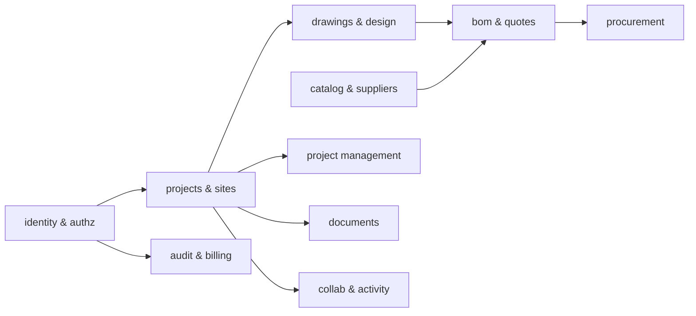
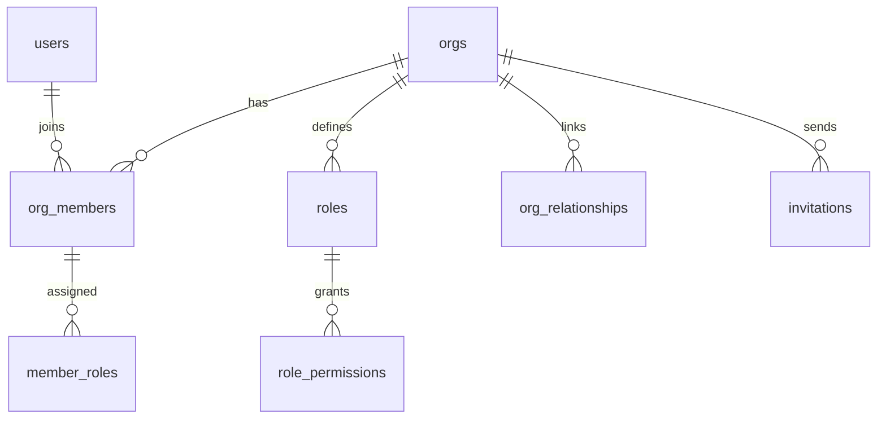
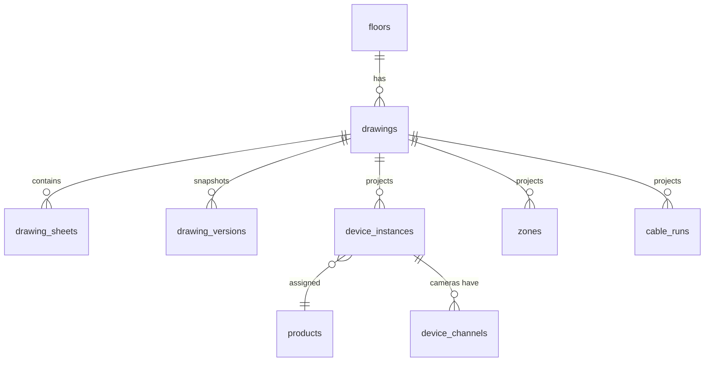

# 03 — Database Schema

PostgreSQL 16. Managed via drizzle migrations in `packages/db`. This document defines conventions, per-domain ERDs, and representative DDL for the load-bearing tables. Column lists are complete for core tables; obvious audit columns are elided elsewhere.

## 1. Conventions

- **Keys:** `id uuid primary key default gen_random_uuid()`. External references (`org_id`, `project_id`, …) always FK-constrained.
- **Tenancy:** every tenant-scoped table has `org_id uuid not null references orgs(id)` and an RLS policy ([doc 04 §6](04-permissions-model.md)). Composite indexes lead with `org_id`.
- **Time:** `created_at timestamptz not null default now()`, `updated_at timestamptz` (trigger-maintained). Soft delete via `deleted_at timestamptz` only on user-facing content tables; hard delete elsewhere.
- **Actors:** `created_by uuid references users(id)` on user-generated rows.
- **Enums:** Postgres enums for closed sets that gate logic (`quote_status`); lookup tables for extensible sets (`product_categories`).
- **Money:** `numeric(14,2)` + `currency char(3)`; FX conversions computed at read time from `fx_rates`, and **frozen** into quote/PO lines at issue time.
- **Specs & geometry payloads:** `jsonb` validated by zod at the API boundary; GIN indexes where queried.
- **Reading the DDL below:** sections are ordered by domain for readability, not by execution order — real migrations create tables in dependency order (e.g. `products` before `device_instances`, `milestones` before `tasks`) or add cross-domain FKs in a follow-up migration.

## 2. Domain map



## 3. Identity & authz



```sql
create table orgs (
  id            uuid primary key default gen_random_uuid(),
  slug          text not null unique,
  name          text not null,
  kind          text not null default 'company',      -- company | supplier | client | platform
  plan          text not null default 'starter',
  settings      jsonb not null default '{}',
  created_at    timestamptz not null default now()
);

create table users (
  id            uuid primary key default gen_random_uuid(),
  email         citext not null unique,
  full_name     text not null,
  avatar_url    text,
  locale        text not null default 'en',           -- 'he' → RTL
  auth_provider text not null default 'password',     -- password | google | saml:<idp>
  created_at    timestamptz not null default now(),
  disabled_at   timestamptz
);

create table org_members (
  id         uuid primary key default gen_random_uuid(),
  org_id     uuid not null references orgs(id),
  user_id    uuid not null references users(id),
  status     text not null default 'active',          -- active | suspended
  seat_type  text not null default 'full',            -- full | field | portal (billing)
  created_at timestamptz not null default now(),
  unique (org_id, user_id)
);

-- Roles: system templates (org_id null) + org-custom roles. Permissions are string keys
-- like 'drawing.edit', 'quote.approve' — full catalog in doc 04.
create table roles (
  id          uuid primary key default gen_random_uuid(),
  org_id      uuid references orgs(id),               -- null ⇒ system template
  key         text not null,                          -- 'project_manager', 'supplier', ...
  name        text not null,
  description text,
  is_system   boolean not null default false,
  unique (org_id, key)
);

create table role_permissions (
  role_id    uuid not null references roles(id) on delete cascade,
  permission text not null,
  primary key (role_id, permission)
);

create table member_roles (
  member_id uuid not null references org_members(id) on delete cascade,
  role_id   uuid not null references roles(id),
  primary key (member_id, role_id)
);

-- Cross-tenant links (integrator ↔ supplier, integrator ↔ client org)
create table org_relationships (
  id          uuid primary key default gen_random_uuid(),
  org_id      uuid not null references orgs(id),      -- owning side
  related_org uuid not null references orgs(id),
  kind        text not null,                          -- supplier | client | partner
  status      text not null default 'active',
  unique (org_id, related_org, kind)
);
```

`invitations`, `api_keys`, `sso_connections`, `scim_tokens` follow the same shape (elided).

## 4. Projects & sites

```sql
create table projects (
  id          uuid primary key default gen_random_uuid(),
  org_id      uuid not null references orgs(id),
  code        text not null,                          -- human key 'PRJ-0042'
  name        text not null,
  status      text not null default 'active',         -- lead|active|on_hold|done|archived
  client_org  uuid references orgs(id),               -- optional client tenant link
  client_name text,                                   -- denormalized display fallback
  currency    char(3) not null default 'USD',
  address     jsonb,
  starts_on   date, ends_on date,
  settings    jsonb not null default '{}',
  created_by  uuid references users(id),
  created_at  timestamptz not null default now(),
  deleted_at  timestamptz,
  unique (org_id, code)
);

-- Physical hierarchy: site → building → floor. Floors own drawings.
create table sites     (id uuid primary key default gen_random_uuid(), org_id uuid not null references orgs(id), project_id uuid not null references projects(id), name text not null, address jsonb, position int not null default 0);
create table buildings (id uuid primary key default gen_random_uuid(), org_id uuid not null references orgs(id), site_id uuid not null references sites(id), name text not null, position int not null default 0);
create table floors    (id uuid primary key default gen_random_uuid(), org_id uuid not null references orgs(id), building_id uuid not null references buildings(id), name text not null, level int not null default 0, height_m numeric(6,2));

-- Per-project membership for externals & scoping (internals get access via org roles;
-- project_members restricts/extends per project — see doc 04 §4)
create table project_members (
  id         uuid primary key default gen_random_uuid(),
  org_id     uuid not null references orgs(id),
  project_id uuid not null references projects(id),
  user_id    uuid not null references users(id),
  member_org uuid references orgs(id),                -- external user's home org (supplier/client)
  role_id    uuid not null references roles(id),
  scope      jsonb not null default '{}',             -- e.g. {"floors": [...], "modules": ["bom.read"]}
  unique (project_id, user_id)
);
```

## 5. Drawings & design

Two layers, deliberately separate:

1. **`drawings.*`** — the CRDT document (opaque to SQL; lives in object storage, metadata here).
2. **`design.*`** — a **relational projection** of semantic objects (devices, zones, cable runs) extracted from the CRDT by the realtime service. SQL-queryable, BOM-joinable, dashboard-aggregatable. The CRDT is the source of truth for geometry; the projection is derived and rebuildable.



```sql
create table drawings (
  id            uuid primary key default gen_random_uuid(),
  org_id        uuid not null references orgs(id),
  project_id    uuid not null references projects(id),
  floor_id      uuid references floors(id),
  name          text not null,
  kind          text not null default 'floorplan',    -- floorplan | site | schematic | detail
  units         text not null default 'mm',
  scale_denom   int,                                  -- 1:scale_denom for the underlay
  crdt_doc_key  text not null,                        -- object-storage prefix for Yjs snapshots/updates
  underlay_file uuid,                                 -- fk → dms.files (PDF/image underlay)
  status        text not null default 'draft',        -- draft | in_review | approved | superseded
  created_by    uuid references users(id),
  created_at    timestamptz not null default now(),
  deleted_at    timestamptz
);

create table drawing_versions (
  id           uuid primary key default gen_random_uuid(),
  org_id       uuid not null references orgs(id),
  drawing_id   uuid not null references drawings(id),
  number       int  not null,                         -- monotonic per drawing
  label        text,                                  -- 'Rev B — issued for construction'
  snapshot_key text not null,                         -- frozen CRDT snapshot in object storage
  created_by   uuid references users(id),
  created_at   timestamptz not null default now(),
  unique (drawing_id, number)
);

-- Semantic projection: one row per placed device (camera, switch, pole, cabinet, sensor…)
create table device_instances (
  id           uuid primary key default gen_random_uuid(),
  org_id       uuid not null references orgs(id),
  project_id   uuid not null references projects(id),
  drawing_id   uuid not null references drawings(id),
  scene_node_id text not null,                        -- id of the node inside the CRDT scene graph
  device_type  text not null,                         -- camera | switch | cabinet | pole | sensor | ...
  label        text,                                  -- 'CAM-014'
  product_id   uuid references products(id),          -- catalog binding (nullable while generic)
  position     jsonb not null,                        -- {x,y} drawing units + mount height
  params       jsonb not null default '{}',           -- camera: tilt, pan, lens_mm, height_m, ir…
  status       text not null default 'planned',       -- planned|ordered|installed|commissioned
  unique (drawing_id, scene_node_id)
);

create index on device_instances (org_id, project_id, device_type);

create table zones (        -- risk zones, privacy-mask zones, coverage-requirement zones
  id uuid primary key default gen_random_uuid(),
  org_id uuid not null references orgs(id),
  drawing_id uuid not null references drawings(id),
  scene_node_id text not null,
  kind text not null,                                 -- risk | privacy | requirement | area
  name text,
  requirement jsonb,                                  -- e.g. {"dori":"observe","min_ppm":63}
  polygon jsonb not null
);

create table cable_runs (
  id uuid primary key default gen_random_uuid(),
  org_id uuid not null references orgs(id),
  project_id uuid not null references projects(id),
  drawing_id uuid not null references drawings(id),
  scene_node_id text not null,
  from_device uuid references device_instances(id),
  to_device   uuid references device_instances(id),
  cable_product uuid references products(id),
  path jsonb not null,                                -- polyline
  length_m numeric(10,2) not null,                    -- computed incl. slack factor
  params jsonb not null default '{}'                  -- containment, poe_watts, ...
);
```

## 6. Catalog & suppliers

```sql
create table product_categories (
  id uuid primary key default gen_random_uuid(),
  parent_id uuid references product_categories(id),
  key text not null unique,                           -- 'camera.bullet', 'network.switch.poe'
  name text not null,
  spec_schema jsonb                                   -- zod-compatible schema for specs of this category
);

create table products (
  id            uuid primary key default gen_random_uuid(),
  owner_org     uuid not null references orgs(id),    -- supplier or tenant-private owner
  visibility    text not null default 'private',      -- private | shared | marketplace
  category_id   uuid not null references product_categories(id),
  manufacturer  text not null,
  model         text not null,
  sku           text,
  name          text not null,
  description   text,
  specs         jsonb not null default '{}',          -- category-schema-validated (sensor size, lens, IR range…)
  lifecycle     text not null default 'active',       -- active | eol | discontinued
  warranty_months int,
  compat        jsonb not null default '{}',          -- mounts, accessories, protocols
  search_tsv    tsvector generated always as
                (to_tsvector('simple', coalesce(manufacturer,'')||' '||coalesce(model,'')||' '||coalesce(name,''))) stored,
  created_at    timestamptz not null default now()
);
create index on products using gin (search_tsv);
create index on products using gin (specs jsonb_path_ops);

create table product_revisions (  -- immutable history of product data changes
  id uuid primary key default gen_random_uuid(),
  product_id uuid not null references products(id),
  revision int not null,
  data jsonb not null,
  created_by uuid references users(id),
  created_at timestamptz not null default now(),
  unique (product_id, revision)
);

create table product_assets (     -- images, datasheets, manuals, certificates
  id uuid primary key default gen_random_uuid(),
  product_id uuid not null references products(id),
  kind text not null,                                 -- image | datasheet | manual | certificate | block
  file_id uuid not null,                              -- fk → dms.files
  position int not null default 0
);

-- Prices are per supplier relationship & currency, time-bounded
create table price_lists (
  id uuid primary key default gen_random_uuid(),
  supplier_org uuid not null references orgs(id),
  buyer_org uuid references orgs(id),                 -- null ⇒ list price
  currency char(3) not null,
  valid_from date not null, valid_to date
);

create table prices (
  id uuid primary key default gen_random_uuid(),
  price_list_id uuid not null references price_lists(id),
  product_id uuid not null references products(id),
  unit_price numeric(14,2) not null,
  moq int not null default 1,
  lead_time_days int,
  stock_qty int,                                      -- snapshot, supplier-updated
  updated_at timestamptz not null default now(),
  unique (price_list_id, product_id)
);
```

## 7. BOM, quotes, procurement

BOM lines are **derived from design** (device + accessories + cable lengths) plus **manual lines**; quotes **pin** a BOM revision so later design edits never silently change an issued quote.

```sql
create table boms (
  id uuid primary key default gen_random_uuid(),
  org_id uuid not null references orgs(id),
  project_id uuid not null references projects(id),
  revision int not null default 1,
  status text not null default 'live',                -- live | frozen (frozen = referenced by a quote)
  totals jsonb not null default '{}',                 -- cached rollup
  unique (project_id, revision)
);

create table bom_lines (
  id uuid primary key default gen_random_uuid(),
  org_id uuid not null references orgs(id),
  bom_id uuid not null references boms(id),
  source text not null,                               -- design | manual | ai_suggested
  device_instance_id uuid references device_instances(id),
  cable_run_id uuid references cable_runs(id),
  product_id uuid references products(id),
  description text not null,
  qty numeric(12,2) not null,
  uom text not null default 'ea',                     -- ea | m | box | lot
  unit_cost numeric(14,2), currency char(3),
  supplier_org uuid references orgs(id),
  labor_hours numeric(8,2),
  group_key text,                                     -- section grouping: 'cameras','network','cabling'
  meta jsonb not null default '{}'
);

create table quotes (
  id uuid primary key default gen_random_uuid(),
  org_id uuid not null references orgs(id),
  project_id uuid not null references projects(id),
  bom_id uuid not null references boms(id),           -- frozen revision
  number text not null,                               -- 'Q-2026-0113-R2'
  status text not null default 'draft',               -- draft|sent|viewed|approved|rejected|expired
  currency char(3) not null,
  pricing jsonb not null,                             -- per-line sell prices, margins, discounts
  tax_config jsonb not null default '{}',
  totals jsonb not null,                              -- {cost, sell, margin_pct, tax, shipping, grand}
  valid_until date,
  approved_by uuid references users(id),              -- client-side approver
  approved_at timestamptz,
  created_by uuid references users(id),
  created_at timestamptz not null default now(),
  unique (org_id, number)
);

create table purchase_orders (
  id uuid primary key default gen_random_uuid(),
  org_id uuid not null references orgs(id),
  project_id uuid not null references projects(id),
  supplier_org uuid not null references orgs(id),
  number text not null,
  status text not null default 'draft',               -- draft|issued|acknowledged|partially_delivered|delivered|cancelled
  currency char(3) not null,
  totals jsonb not null default '{}',
  expected_delivery date,
  unique (org_id, number)
);

create table po_lines (
  id uuid primary key default gen_random_uuid(),
  po_id uuid not null references purchase_orders(id),
  bom_line_id uuid references bom_lines(id),
  product_id uuid references products(id),
  description text not null,
  qty numeric(12,2) not null,
  unit_price numeric(14,2) not null,
  delivered_qty numeric(12,2) not null default 0
);
```

## 8. Project management

```sql
create table milestones (id uuid primary key default gen_random_uuid(), org_id uuid not null references orgs(id), project_id uuid not null references projects(id), name text not null, due_on date, status text not null default 'open');

create table tasks (
  id uuid primary key default gen_random_uuid(),
  org_id uuid not null references orgs(id),
  project_id uuid not null references projects(id),
  parent_id uuid references tasks(id),                -- subtasks
  milestone_id uuid references milestones(id),
  title text not null,
  description text,
  status text not null default 'todo',                -- todo|in_progress|blocked|review|done
  priority text not null default 'medium',
  assignee uuid references users(id),
  starts_on date, due_on date,
  estimate_h numeric(8,2), spent_h numeric(8,2),
  device_instance_id uuid references device_instances(id),  -- design linkage (install task ↔ device)
  drawing_id uuid references drawings(id),
  position numeric not null default 0,                -- kanban ordering (fractional)
  created_by uuid references users(id),
  created_at timestamptz not null default now(),
  deleted_at timestamptz
);

create table task_dependencies (
  predecessor uuid not null references tasks(id) on delete cascade,
  successor   uuid not null references tasks(id) on delete cascade,
  kind text not null default 'FS',                    -- FS|SS|FF|SF
  lag_days int not null default 0,
  primary key (predecessor, successor)
);

create table risks (
  id uuid primary key default gen_random_uuid(),
  org_id uuid not null references orgs(id),
  project_id uuid not null references projects(id),
  title text not null, description text,
  probability int not null,                           -- 1..5
  impact int not null,                                -- 1..5
  mitigation text, owner uuid references users(id),
  status text not null default 'open'
);

create table change_requests (
  id uuid primary key default gen_random_uuid(),
  org_id uuid not null references orgs(id),
  project_id uuid not null references projects(id),
  number text not null,
  title text not null, description text,
  status text not null default 'open',                -- open|estimating|awaiting_approval|approved|rejected|implemented
  cost_delta numeric(14,2), schedule_delta_days int,
  quote_id uuid references quotes(id),                -- CR can carry its own mini-quote
  requested_by uuid references users(id),
  unique (org_id, number)
);
```

`issues`, `meeting_notes`, `approvals` (generic approval workflow: `subject_type/subject_id`, ordered approver steps, decisions) follow the same patterns.

## 9. Documents (DMS)

```sql
create table folders (id uuid primary key default gen_random_uuid(), org_id uuid not null references orgs(id), project_id uuid references projects(id), parent_id uuid references folders(id), name text not null);

create table files (
  id uuid primary key default gen_random_uuid(),
  org_id uuid not null references orgs(id),
  project_id uuid references projects(id),
  folder_id uuid references folders(id),
  name text not null,
  mime text not null,
  size_bytes bigint not null,
  storage_key text not null,                          -- org/{org}/files/{id}/v{n}
  version int not null default 1,
  content_hash text not null,                         -- dedupe + conversion cache key
  kind text,                                          -- drawing|contract|invoice|photo|manual|permit|report
  ocr_text tsvector,                                  -- populated by OCR worker
  ai_summary text,
  uploaded_by uuid references users(id),
  created_at timestamptz not null default now(),
  deleted_at timestamptz
);
create index on files using gin (ocr_text);

create table file_versions (file_id uuid not null references files(id), version int not null, storage_key text not null, size_bytes bigint not null, uploaded_by uuid references users(id), created_at timestamptz not null default now(), primary key (file_id, version));

create table signatures (id uuid primary key default gen_random_uuid(), org_id uuid not null references orgs(id), file_id uuid not null references files(id), signer_user uuid references users(id), signer_email citext, signed_at timestamptz, signature_data jsonb, status text not null default 'pending');
```

## 10. Collaboration & activity

```sql
create table comments (
  id uuid primary key default gen_random_uuid(),
  org_id uuid not null references orgs(id),
  project_id uuid not null references projects(id),
  subject_type text not null,                         -- drawing|task|file|quote|rfi|device
  subject_id uuid not null,
  anchor jsonb,                                       -- drawing coords / file page / line id
  parent_id uuid references comments(id),             -- threads
  body text not null,                                 -- markdown w/ @mentions
  resolved_at timestamptz, resolved_by uuid references users(id),
  created_by uuid not null references users(id),
  created_at timestamptz not null default now(),
  deleted_at timestamptz
);
create index on comments (org_id, subject_type, subject_id);

create table notifications (id uuid primary key default gen_random_uuid(), org_id uuid not null references orgs(id), user_id uuid not null references users(id), kind text not null, payload jsonb not null, read_at timestamptz, created_at timestamptz not null default now());

create table activity_events (   -- user-facing feed; monthly partitions
  id uuid not null default gen_random_uuid(),
  org_id uuid not null references orgs(id),
  project_id uuid,
  actor uuid references users(id),
  verb text not null,                                 -- 'device.placed','quote.sent',...
  subject_type text not null, subject_id uuid,
  payload jsonb not null default '{}',
  created_at timestamptz not null default now(),
  primary key (id, created_at)                        -- partition key must be in the PK
) partition by range (created_at);
```

RFIs & submittals (portal workflows) live in `portal.*`: `rfis(number, question, answer, status, due_on, assignee, external_org)`, `submittals(product_id, status, decision, decided_by)` — same conventions.

## 11. AI & search support

```sql
create extension if not exists vector;

create table embeddings (
  id uuid primary key default gen_random_uuid(),
  org_id uuid not null references orgs(id),
  source_type text not null,                          -- file_chunk|comment|task|product|meeting
  source_id uuid not null,
  chunk_index int not null default 0,
  content text not null,
  embedding vector(1024) not null,
  created_at timestamptz not null default now()
);
create index on embeddings using hnsw (embedding vector_cosine_ops);

create table ai_conversations (id uuid primary key default gen_random_uuid(), org_id uuid not null references orgs(id), project_id uuid, user_id uuid not null references users(id), title text, created_at timestamptz not null default now());
create table ai_messages (id uuid primary key default gen_random_uuid(), conversation_id uuid not null references ai_conversations(id), role text not null, content jsonb not null, tool_calls jsonb, tokens int, created_at timestamptz not null default now());
```

## 12. Audit & billing

```sql
create table audit_log (            -- append-only; INSERT-only role; monthly partitions
  id bigint generated always as identity,
  org_id uuid not null,
  actor uuid,                       -- null ⇒ system
  ip inet, user_agent text,
  action text not null,             -- 'auth.login','permission.granted','quote.approved',...
  subject_type text, subject_id uuid,
  before jsonb, after jsonb,
  created_at timestamptz not null default now(),
  primary key (id, created_at)
) partition by range (created_at);

create table usage_events (org_id uuid not null, metric text not null, qty numeric not null, at timestamptz not null default now());  -- seats, storage, AI tokens, exports
```

## 13. Indexing & performance baseline

- Every FK indexed; composite hot-path indexes: `device_instances(org_id, project_id, device_type)`, `tasks(org_id, project_id, status)`, `bom_lines(bom_id)`, `comments(org_id, subject_type, subject_id)`, `prices(price_list_id, product_id)`.
- Partitioned: `activity_events`, `audit_log` (monthly). Archived partitions detach to cold storage.
- Dashboards read from materialized rollups (`project_financial_rollup`, `coverage_rollup`) refreshed by workers on domain events — never heavy aggregate queries on the hot path.
- Derived-data rule: anything in `design.*` (projection) or `totals` caches must be rebuildable from source (CRDT / lines) by a worker command — corruption recovery is a re-run, not a restore.
