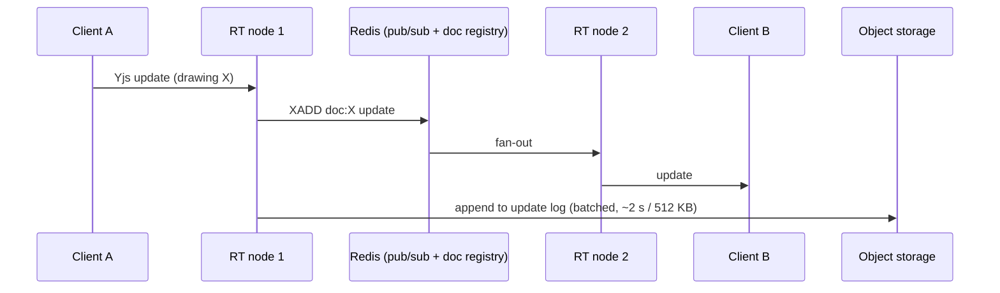

# 10 — Collaboration & Realtime

Google-Docs-grade collaboration on CAD documents and live everything else. Runs in `apps/realtime` ([doc 02 §3](02-system-architecture.md)); protocol in [doc 05 §5](05-api-architecture.md).

## 1. Why CRDT (Yjs), not OT

| | CRDT (Yjs) — chosen | OT — rejected |
|---|---|---|
| Server role | Relay + persistence (stateless w.r.t. correctness) | Must serialize/transform every op — single point of logic |
| Offline / flaky mobile | Merges arbitrarily late edits (field app requirement) | Needs server round-trips; long-offline merge is painful |
| Data model fit | Y.Map of independent nodes = our flat scene graph; concurrent edits to different nodes never conflict | Designed for linear text |
| Ecosystem | Mature (Yjs), binary-efficient, `UndoManager`, awareness protocol | Bespoke per data model |

Cost accepted: CRDT metadata overhead — managed by snapshot compaction (§3) and per-sheet subdocuments at scale.

**Conflict semantics for CAD:** last-writer-wins per node field is acceptable (two people dragging the same camera = one wins, both see the result instantly; locks below for the cases where it isn't). Structural invariants that CRDTs can't express (e.g. dangling `blockRef`) are repaired by a deterministic post-merge validator — the same code on every client yields the same repair, so convergence holds.

## 2. Topology

- **Doc-sticky routing:** consistent hash of `drawing_id` → primary RT node (registry in Redis with leases); clients are redirected on connect; failover = lease expiry → next node loads snapshot+log. Cross-node fan-out via Redis streams covers routing races.
- **Authorization at the door and per message class:** connect ticket ([doc 05 §5](05-api-architecture.md)) checks `drawing.view`; edit messages require `drawing.edit` (view-only collaborators get sync + awareness but their updates are rejected).

## 3. Persistence & versions

- **Update log:** batched Yjs updates appended to object storage (`org/{org}/drawings/{id}/log/…`).
- **Snapshot compaction:** worker merges log → snapshot when log > threshold (count/bytes); load = latest snapshot + tail. Old logs retained per plan's history window, then pruned.
- **Named versions** (`drawing_versions`, [doc 03 §5](03-database-schema.md)): user- or workflow-created ("Rev B — issued for construction") = frozen snapshot key. **Rollback = restore-as-new-version** (history is never rewritten). Diff view between versions: semantic diff on the node map (added/removed/moved/re-bound devices; changed geometry counts) — not pixel diff.
- **Auto-checkpoints:** hourly while active, so "view drawing as of yesterday 14:00" works without user discipline.

## 4. Presence & awareness

Yjs awareness protocol on the doc channel carries `{user, color, cursor, selection[], activeTool, viewport}` → live cursors, selection highlights ("Dana is editing CAM-014"), optional follow-mode (jump to a collaborator's viewport). Presence roster surfaces in the editor header. Awareness is ephemeral (never persisted).

**Soft locks:** selecting an object marks it in awareness; others see it highlighted and the UI nudges (not blocks) concurrent grabs. Hard locks (`locked` flag on nodes/layers) are document state, for title blocks and approved underlays.

## 5. Comments, mentions, notifications

- **Comments** are relational, not CRDT ([doc 03 §10](03-database-schema.md)) — they need cross-subject queries, permissions, and resolution workflows. Drawing comments anchor to `{nodeId}` (follow the object) or `{x,y}` (pin); threads, @mentions, resolve/unresolve. Rendered as pins on canvas + sidebar list; portal users' comments are the client-feedback channel.
- **Mentions** notify via the event channel + email digest (per-user notification preferences: instant/digest/mute per event class).
- **Activity log:** every domain event projects into `activity_events` → project feed, filterable; distinct from the compliance `audit_log`.

## 6. Non-drawing realtime

The same event channel updates Kanban moves, BOM totals, quote status, delivery updates, and dashboards. Rule: **REST mutates, events refresh** — clients never mutate via socket except CRDT docs. Optimistic UI with reconciliation on the echoed event.

## 7. Offline & field mode

- Web editor: short disconnects buffer Yjs updates in IndexedDB (y-indexeddb) and resync — free with CRDT.
- Field PWA (M5+): read-optimized project bundle (drawings snapshots, tasks, checklists) cached locally; mutations (task status, photos, issues, device commissioning) queue through an outbox with idempotency keys; conflicts resolved server-side by domain rules (checklist ticks merge; status regressions flag for review). Full offline *editing* of drawings is deliberately out of scope for the field app — markup layers only.

## 8. Scale limits & levers

| Concern | Limit posture | Lever |
|---|---|---|
| Editors per doc | Design target 25 concurrent | Awareness throttling (10 Hz), update batching |
| Doc size | 20k nodes comfortable | Per-sheet Yjs subdocuments; lazy-load sheets |
| RT node loss | Lease failover < 5 s | Clients auto-resync via state vectors (no data loss by construction) |
| History growth | Compaction + plan-based retention | Cold storage for old logs |
