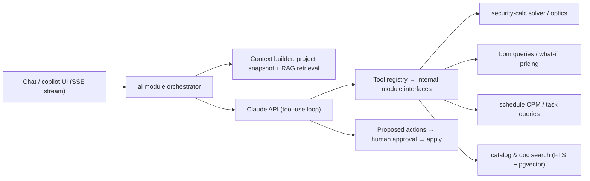

# 12 — AI Architecture

AI is embedded per-module, not a bolted-on chatbot. One orchestration layer (`ai` module) serves every surface. Core principle from [doc 02 §1](02-system-architecture.md): **deterministic math is code, not AI** — the LLM orchestrates tools and explains results; it never invents a coverage number, price, or schedule date.

## 1. Surfaces

| Surface | Examples |
|---|---|
| **Project assistant** (chat panel, project-scoped) | "What's blocking the Floor 2 install?" · "Summarize open RFIs for the client call" · "Why is margin down on Quote R3?" |
| **Design copilot** (editor side panel) | "Cover the loading dock at Observe level with ≤3 cameras" → zones + solver run + proposed placements · "Swap all CAM-A to the cheaper Hanwha with same DORI" |
| **Inline generators** | Proposal narrative, RFI answer drafts, meeting minutes + action items, report sections, risk suggestions, task estimates |
| **Findings feed** (proactive, batch) | Design conflicts, missing components, stale prices, EOL products in design, schedule/material conflicts — deterministic rule engines produce findings; AI ranks and explains them |

## 2. Orchestration

- **Models:** `claude-sonnet-5` default; `claude-haiku-4-5` for cheap paths (summaries, extraction, ranking); model choice per task type in config, never hardcoded.
- **Tool registry:** typed tools wrapping the same module interfaces the REST API uses — so every tool call is authorization-checked with the *requesting user's* permission context ([doc 04](04-permissions-model.md)). The AI can never read or do what the user couldn't. Tools are read-mostly: `search_products`, `get_coverage`, `run_placement_solver`, `get_bom`, `compare_suppliers`, `get_schedule`, `search_documents`, `get_findings`…
- **Write path = proposals:** mutating suggestions are returned as structured **proposed actions** (`{type: 'bind_product', device_ids, product_id, diff_preview}`) rendered as reviewable cards; `POST /ai/actions/{id}/apply` executes after explicit human approval — and is audited as `actor=user, via=ai`. No silent writes, ever.

## 3. RAG & context

- **Index:** `embeddings` table (pgvector, HNSW — [doc 03 §11](03-database-schema.md)) over file chunks (OCR'd docs, contracts, manuals), comments/RFIs, meeting notes, product specs, standards rule-pack texts. Indexing is event-driven by workers; org-scoped with RLS like everything else.
- **Retrieval:** hybrid — vector + FTS + recency/subject boosts; project-scoped by default, org-scoped on request.
- **Structured context beats retrieval where possible:** for project questions, the context builder assembles a deterministic snapshot (status, critical path, open findings, budget rollup) rather than hoping RAG finds it. Retrieval covers the long tail (documents, history).
- **Grounding contract:** answers cite sources (file/page, RFI number, computation id); UI renders citations as deep links. Uncited numeric claims are stripped by a post-processor in report-generation paths.

## 4. Domain-specific AI features (implementation notes)

| Feature (from brief) | How |
|---|---|
| Optimize camera placement / suggest layouts | Solver in `security-calc` does the math ([doc 07 §5](07-security-design-module.md)); LLM translates NL requirements into solver inputs (zones, rule packs, budgets) and explains trade-offs of returned candidates |
| Reduce project cost | Deterministic what-if engines: supplier mix optimizer, equivalent-product finder (same category + spec distance + DORI parity check); LLM narrates options with citations |
| Detect design conflicts / missing components | Rule engine over the design graph ([doc 08 §3.1](08-catalog-and-bom.md)) + geometry checks (device collisions, door-swing, unreachable mounts); AI ranks/explains, humans fix |
| Estimate project duration | Labor-norm model (devices × install norms by type/height) proposes task estimates → CPM computes duration; norms tunable per org from historicals |
| Explain standards | RAG over rule-pack documentation + licensed standard summaries; always cites the pack version |
| Meeting summaries | Transcript/notes → minutes + extracted action items proposed as tasks ([doc 09 §4](09-project-management.md)) |
| Generate documentation/reports | Templated generators with AI-drafted narrative sections; all figures injected from computed data |

## 5. Guardrails, cost, privacy

- **Quotas & metering:** per-org token budgets by plan (`usage_events`); model tiering; caching of identical tool-result summarizations; heavy jobs (doc summarization backfill) run in workers at off-peak priority.
- **Prompt-injection posture:** retrieved document content and portal-user text are untrusted; system prompts instruct against instruction-following from retrieved content; tool allowlist per surface; proposed-action review gate is the hard stop.
- **Privacy:** org data never trains shared models; per-org retrieval isolation enforced by RLS; enterprise tier can disable AI per module or route to a dedicated API key; AI conversation history stored per org (`ai_conversations`) and covered by retention policy.
- **Evaluation:** golden Q&A sets per surface (project questions with known answers from fixtures); solver-explanation faithfulness checks (numbers in text must match tool outputs); regression eval runs on prompt/model changes.
