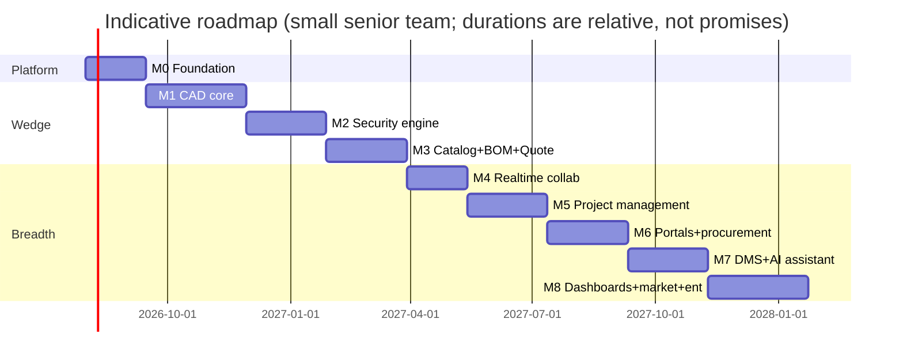

# 14 — Roadmap, Risks & Scalability

## 1. Sequencing rationale

The order optimizes for **earliest defensible differentiation** (security engineering on a live canvas), then **earliest revenue proof** (BOM→quote), then breadth. Platform primitives (tenancy, RBAC, files, events) come first because every module leans on them; collaboration lands *after* the editor exists but *before* PM/portals so all later modules are born realtime. Each milestone ends with a demoable exit criterion — no horizontal half-layers.

## 2. Milestones

### M0 — Foundation
Monorepo, CI/CD, IaC, environments; identity (orgs, users, invitations), RBAC + RLS + isolation tests; projects/sites/floors; file upload (presigned) + thumbnails; app shell + design system core (tokens, dark/light, RTL); outbox/event bus; audit log; billing skeleton (plans/seats).
**Exit:** two tenants coexist provably isolated; user invites teammate; creates project; uploads floorplan PDF; CI enforces module boundaries.

### M1 — CAD core
Canvas renderer (WebGL2 + fallback), scene graph on Yjs (single-user persistence path), tools (select/move/line/polyline/arc/circle/text/measure/dimension), snapping+grid+ortho, layers, blocks + symbol library v1, PDF/image underlay with scale calibration, DXF import, PDF/PNG/SVG export, undo/redo, autosave+checkpoints.
**Exit:** designer imports a real floorplan PDF, calibrates scale, draws a marked-up plan, exports a scaled PDF — daily-drivable by design partners.

### M2 — Security design engine ★ differentiator
Device placement (camera/pole/cabinet/generic), camera params + optics engine, FoV footprints with occlusion (visibility polygons), DORI bands, requirement zones + compliance, blind-spot findings, heatmap overlay, night/IR layer, camera preview, lens picker, coverage report export (PDF), camera schedule (XLSX). Golden tests vs. JVSG/manufacturer calculators; consultant validation panel.
**Exit:** consultant produces a client-ready, standards-cited coverage report competitive with JVSG — from the browser. **This is the fundable demo.**

### M3 — Catalog + BOM + Quote (the money loop)
Catalog (categories+spec schemas, products, assets, revisions, search, XLSX import, seed data), price lists, design↔product binding + kit expansion, cable runs + length-driven BOM + PoE checks, live BOM with rollups, completeness findings, quote builder (freeze, pricing/margins, tax, PDF proposal), exports (XLSX/CSV/PDF), quote send + tokenized client approval (minimal portal page).
**Exit:** floorplan → engineered design → bound products → live BOM → branded quote PDF → client approves online. End-to-end wedge complete; first paying customers.

### M4 — Realtime collaboration
Realtime service to full multi-user (doc-sticky routing, Redis fan-out, compaction), presence/cursors/selection, comments+mentions+notifications, named versions + restore + semantic diff, event channel driving live BOM/status refresh everywhere.
**Exit:** 10 users co-edit a drawing with live BOM updates; version restore and comment threads work.

### M5 — Project management
Tasks/subtasks/milestones, Kanban+list+calendar, Gantt + CPM + baselines, task↔device generators, risk register, issues, meetings + AI minutes (first AI surface), approvals engine, change requests with delta-BOM. Field PWA alpha (checklists, photos, snags).
**Exit:** a real installation runs on the platform: install tasks generated from design, schedule respects deliveries, CR flows change scope+quote.

### M6 — Portals + procurement + DWG
Client portal (status, viewer, approvals, comments), supplier portal (catalog self-service, RFQ, sealed quotes, PO ack, delivery updates), supplier comparison optimizer, PO lifecycle + receiving, RFIs + submittals, **DWG import via conversion worker** (build-vs-buy spike concluded), webhooks + API keys GA.
**Exit:** a project runs with client + two suppliers collaborating externally; DWG floorplans import.

### M7 — DMS depth + AI assistant
Full DMS (versioning UX, signatures, retention), OCR + federated search, RAG indexing, project assistant + design copilot + proposed-actions gate, findings feed, proposal/report narrative generation, cost-reduction what-ifs.
**Exit:** assistant answers project questions with citations; copilot proposes placements accepted through review gate.

### M8 — Dashboards, marketplace, enterprise
Dashboard suite (exec/financial/procurement/coverage/resource/risk) on materialized rollups; marketplace visibility tier + commission billing; SSO/SAML + SCIM; audit export/SIEM; white-label theming; self-host packaging; OpenSearch swap if needed; usage analytics.
**Exit:** enterprise deal closeable (SSO+audit+SLA); marketplace transacting.

### Post-M8 horizon
3D visualization (extruded walls + frustums), IFC import, photometric lighting simulation, radar/access-control/fence coverage providers, drone survey ingestion, ERP connectors as marketplace apps, mobile-native field app if PWA hits limits.

## 3. Risk register

| # | Risk | P | I | Mitigation |
|---|---|---|---|---|
| R1 | **CAD editor quality bar** — pros reject anything that feels like a toy | H | H | M1 exit = daily-drivable by design partners; AutoCAD command-bar muscle memory; perf budgets in CI; cut scope breadth before cutting editor depth |
| R2 | **Camera math credibility** — one wrong DORI number kills consultant trust | M | H | Golden tests vs. JVSG/manufacturer tools ≤1% tolerance; external consultant validation; assumptions printed on every report |
| R3 | **DWG interop cost/complexity** | H | M | Phased (D3); underlay-first covers most real workflows; spike with real customer files before committing to ODA license |
| R4 | **Scope obesity** — 10 modules invites building 10 mediocre things | H | H | Wedge sequencing; milestone exit criteria are demos, not feature lists; deferred-list triggers ([doc 01 §4](01-product-strategy.md)) |
| R5 | **Marketplace cold start** — empty catalog = broken BOM promise | M | H | Tenant-private catalogs + platform-curated seed data first; marketplace only at M8 with proven supplier engagement |
| R6 | **Multi-tenant data leak** | L | Critical | RLS backstop + app guards + CI isolation tests as release blockers; audit log; pen test before enterprise tier |
| R7 | **Realtime scale/complexity** | M | M | Yjs (proven), doc-sticky routing, compaction; per-sheet subdocs as escape valve; load tests at M4 exit |
| R8 | **AI cost blowout / trust damage from hallucination** | M | M | Deterministic-math rule; proposed-action gate; citations; per-org quotas; model tiering |
| R9 | **Incumbent response** (Autodesk/Procore bundling) | M | M | Speed in the vertical; catalog + project-corpus network effects; integrations rather than war on all fronts |
| R10 | **Team size vs. ambition** | H | H | Modular monolith (low ops burden), TS everywhere (one hiring profile), buy boring parts (auth adapters, billing via Stripe), ruthless milestone discipline |

## 4. Scalability plan (growth stages)

| Stage | Profile | Architecture posture |
|---|---|---|
| 0→50 tenants | Design partners, single region | One PaaS/k8s cluster; single Postgres (HA); Redis; S3; ~monthly load tests |
| 50→500 | First enterprise, marketplace beta | Read replicas for dashboards; partitioned activity/audit; per-queue worker autoscaling; OpenSearch if FTS strains; CDN for tile pyramids |
| 500→5k | Multi-region pressure, white-label | Tenant-router + dedicated DBs for heavy tenants; realtime regional pods (doc-sticky by region); event bus → NATS/Kafka via the outbox seam; self-host distribution hardened |
| 5k+ | Platform | Extract modules along the pre-cut seams only where org/team boundaries demand it (Conway-driven, not fashion-driven) |

Standing SLOs from M4: API p95 < 300 ms; editor open p95 < 2.5 s; realtime echo p95 < 150 ms; monthly uptime 99.9% (99.95% enterprise tier).

## 5. Immediate next steps (post-approval)

1. Create dedicated product repo; land this `docs/` set + ADR process (each D-decision from [doc 00 §4](00-executive-summary.md) becomes ADR-001…).
2. Scaffold monorepo per [doc 02 §7](02-system-architecture.md) with CI, module-boundary lint, and the RLS isolation test harness (empty but wired).
3. Recruit 5 design-partner integrators/consultants (feeds M1/M2 exit criteria and the DXF/DWG test corpus).
4. Begin M0.
